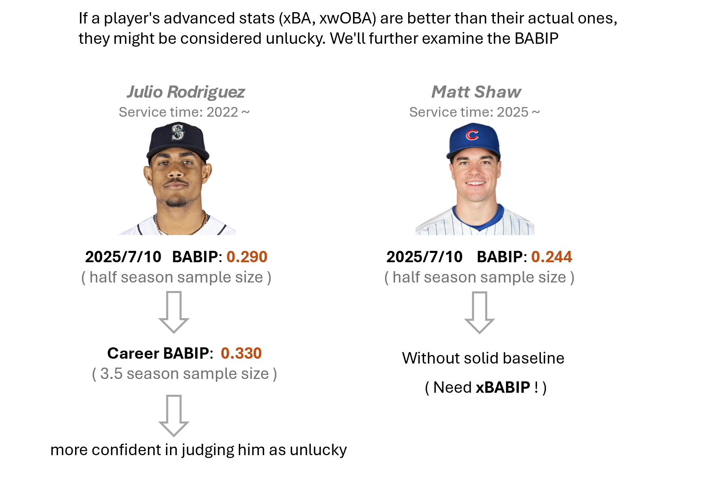

# xBABIP
xBABIP prediction for MLB rookie players 

  

---

This is a regression model for expected BABIP (xBABIP) prediction, especially for first-year players

- Batting Average on Balls In Play (BABIP) 
This statistic is commonly used to evaluate a baseball hitter's "luck"
For a detailed definition and explanation, visit FanGraphs: https://library.fangraphs.com/pitching/babip/

---
will be updated

